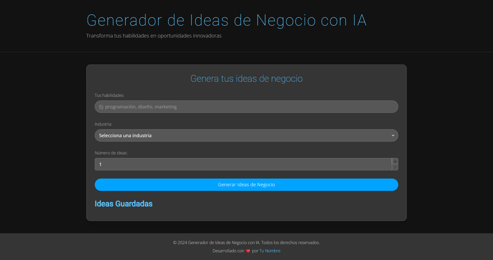

# 🚀 Generador de Ideas de Negocio con IA



## 🌟 Descripción

El Generador de Ideas de Negocio con IA es una herramienta innovadora que utiliza inteligencia artificial para crear ideas de emprendimiento personalizadas. Basándose en las habilidades del usuario y las tendencias del mercado, nuestra aplicación genera conceptos de negocio únicos y viables.

## ✨ Características

- 🧠 Generación de ideas basada en IA
- 🎨 Interfaz moderna y atractiva con modo oscuro
- 📊 Filtros por industria y número de ideas
- 💾 Guardado de ideas favoritas
- 📤 Compartir ideas en redes sociales
- 📄 Exportación de ideas a PDF
- 🏷️ Sistema de etiquetas para categorizar ideas

## 🛠️ Tecnologías Utilizadas

- Next.js
- React
- TypeScript
- Chakra UI
- OpenAI API
- Axios

## 🚀 Cómo Empezar

1. Clona el repositorio:
   ```
   git clone https://github.com/tu-usuario/generador-ideas-negocio-ia.git
   ```

2. Instala las dependencias:
   ```
   cd generador-ideas-negocio-ia
   npm install
   ```

3. Configura las variables de entorno:
   Crea un archivo `.env.local` en la raíz del proyecto y añade tu clave API de OpenAI:
   ```
   OPENAI_API_KEY=tu_clave_api_aqui
   ```

4. Inicia el servidor de desarrollo:
   ```
   npm run dev
   ```

5. Abre [http://localhost:3000](http://localhost:3000) en tu navegador para ver la aplicación.

## 📈 Roadmap

- [ ] Implementar sistema de votación de ideas
- [ ] Añadir sección "Idea del día"
- [ ] Crear galería de ideas populares
- [ ] Implementar chatbot para preguntas frecuentes
- [ ] Desarrollar widget "Idea del día" para sitios web externos

## 🤝 Contribuir

Las contribuciones son bienvenidas. Por favor, abre un issue o realiza un pull request con tus ideas.

## 📄 Licencia

Este proyecto está bajo la Licencia MIT.

## 📞 Contacto

[Tu Nombre] - [@tu_twitter](https://twitter.com/tu_twitter) - tu_email@ejemplo.com

Link del Proyecto: [https://github.com/tu-usuario/generador-ideas-negocio-ia](https://github.com/tu-usuario/generador-ideas-negocio-ia)
